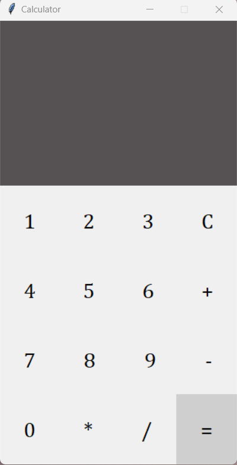

# Python Calculator GUI

This project is a simple calculator application built using Tkinter in Python. It allows users to perform basic arithmetic operations, including addition, subtraction, multiplication, and division.

## Features
- Perform basic arithmetic operations: addition, subtraction, multiplication, and division.
- Handle user input effectively and display results clearly on the calculator screen.
- Recognize and correctly execute basic arithmetic operators (+, -, *, /).
- Follow the standard order of operations to ensure correct calculation results.
- Gracefully handle invalid inputs, such as division by zero.

## Technology Stack
- Programming Language: Python
- Graphical User Interface (GUI) Toolkit: Tkinter

## How to Run

1. Clone the repository to your local machine.
2. Open a terminal window and navigate to the project directory.
3. Run the Calculator Application using the following command:

```bash
  python app.py
```

## Screenshot
